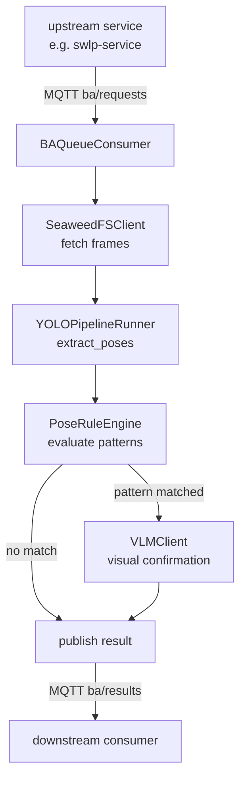
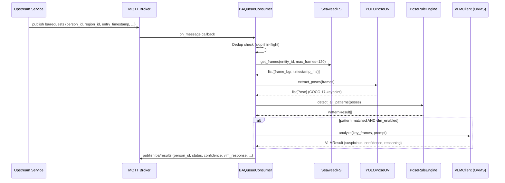

# How It Works

## High-Level Architecture

The Behavioral Analysis Service is a single-process Python microservice that combines three distinct AI capabilities: skeletal pose extraction (YOLO-Pose via OpenVINO), declarative pattern matching (rule engine), and optional visual confirmation (VLM via OVMS). It is fully event-driven; processing is triggered by MQTT messages.



---

## Component Responsibilities

| Component | Module | Responsibility |
|---|---|---|
| Application entry | `main.py` | Application lifecycle, MQTT consumer initialization |
| Configuration | `config.py` | Pydantic `Settings` class, YAML pattern config loader, VLM settings override |
| MQTT consumer | `ba_queue.py` | Subscribe to `ba/requests`, dispatch analysis tasks, publish to `ba/results` |
| Frame store client | `seaweedfs_client.py` | Async S3-compatible reads from SeaweedFS; bucket creation and health check |
| Pose pipeline | `yolo_pipeline.py` | Lazy-initialized YOLO model singleton; per-frame inference |
| YOLO OpenVINO wrapper | `yolo_pose_ov.py` | OpenVINO IR model loader; letterbox preprocessing; NMS postprocessing |
| Pose analyzer | `pose_analyzer.py` | Orchestrates pose detection + VLM confirmation; `PoseAnalyzer` class |
| Rule engine | `pose_rule_engine.py` | Evaluates YAML-defined pose conditions and phases against pose sequences |
| VLM client | `vlm_client.py` | Async HTTP client for OpenAI-compatible VLM endpoint; circuit breaker; image encoding |

---

## Package / Module Overview

```
src/
├── main.py            — Application startup, lifespan management, MQTT consumer initialization
├── config.py          — Settings (env vars) + YAML config parsing
├── ba_queue.py        — MQTT subscriber, analysis task dispatcher, result publisher
├── seaweedfs_client.py — Async frame retrieval from SeaweedFS
├── yolo_pipeline.py   — extract_poses(): run YOLO-Pose on a list of frames
├── yolo_pose_ov.py    — YOLOPoseOV: OpenVINO YOLO wrapper (no PyTorch)
├── pose_analyzer.py   — PoseAnalyzer: detect_pattern(), analyze_with_vlm()
├── pose_rule_engine.py — PoseRuleEngine: declarative YAML rule evaluation
└── vlm_client.py      — VLMClient: async multimodal HTTP client with circuit breaker
```

---

## Request Lifecycle (MQTT Path)




---

## Frame Storage Layout

Frames are stored in SeaweedFS under the following path structure:

```
bucket: behavioral-frames
└── {entity_id}/
    └── {region_id}/
        └── {entry_timestamp}/
            └── frames/
                ├── {timestamp_1}.jpg
                ├── {timestamp_2}.jpg
                └── ...
```

The client sorts objects by timestamp filename to maintain chronological order before pose extraction.

---

## Pose Extraction

The pose extraction pipeline is orchestrated by `extract_poses()` in `yolo_pipeline.py` and implemented via the `YOLOPoseOV` class in `yolo_pose_ov.py`.

**Model Architecture:**
- OpenVINO IR format (no PyTorch at runtime): XML model definition + BIN weights
- Input: Letterboxed 640×640 float32 tensor normalized to [0, 1]
- Output shape: `(1, 300, 57)` — up to 300 detections per image
  - 4 values: bounding box (x_center, y_center, width, height)
  - 1 value: detection confidence score
  - 1 value: class ID (ignored; always 0 for person)
  - 51 values: 17 keypoints × 3 (x, y, confidence per keypoint)

**Processing pipeline:**
1. **Preprocessing:** Image resized via letterboxing (maintains aspect ratio, pads with 114 gray); converted to float32 [0, 1]
2. **Inference:** OpenVINO compiled model runs on configured device (CPU/GPU/NPU via `GST_INFERENCE_DEVICE`)
3. **Postprocessing:**
   - NMS (Non-Maximum Suppression) filters overlapping detections
   - Detections with confidence < `POSE_CONFIDENCE_THRESHOLD` (default 0.5) are discarded
   - Keypoints with per-keypoint confidence < threshold are zeroed
   - Highest-confidence detection per frame is selected for analysis

**COCO 17-keypoint format** (indexes 0–16):
Nose, Left Eye, Right Eye, Left Ear, Right Ear, Left Shoulder, Right Shoulder, Left Elbow, Right Elbow, Left Wrist, Right Wrist, Left Hip, Right Hip, Left Knee, Right Knee, Left Ankle, Right Ankle

For feature overview, see [Key Features: Pose Extraction](./index.md#41-pose-extraction).

---

## Pattern Rule Engine

The `PoseRuleEngine` evaluates patterns defined in `config/patterns.yaml`. Patterns are declarative: no code changes required to add new behaviors.

**Supported relation types:**

| Relation | Semantics | Example Use |
|---|---|---|
| `above` / `below` | Vertical positioning between keypoints | Wrist above shoulder (reaching) |
| `left_of` / `right_of` | Horizontal positioning | Hand left of torso (asymmetry) |
| `near` / `far` | Distance relative to torso length (normalized 0–1) | Wrist near waist (0.4× torso length) |
| `bent` / `straight` | Joint angle (degrees) at a vertex keypoint | Elbow bent 20–165° |
| `moving_fast` / `stationary` | Velocity magnitude between consecutive frames | Arm moving quickly |
| `not_<relation>` | Negation of any relation | NOT above (i.e., below or equal) |

**Phase-based evaluation:**
- Patterns are organized into **ordered phases** representing temporal stages of behavior
- Each phase specifies `min_frames`: minimum consecutive frames where all conditions hold
- Engine performs **sliding-window matching**: seeks best-matching N-frame partition in the pose sequence where all phases satisfy their constraints in order
- If `per_side: true` in pattern config: conditions auto-expand into left/right variants (e.g., `elbow_bent` → `left_elbow_bent`, `right_elbow_bent`)

**Example: shelf_to_waist pattern**
Detects concealment via hand movement from shoulder-height to waist with bent elbow:
```yaml
patterns:
  shelf_to_waist:
    enabled: true
    alert_type: CONCEALMENT
    pose:
      phases:
        - name: arm_handling_near_body
          min_frames: 20
          conditions:
            - subject: elbow
              relation: bent
              reference: [shoulder, wrist]  # bent at elbow joint
              min_angle: 20
              max_angle: 165
            - subject: wrist
              relation: near
              reference: waist_midpoint
              threshold: 0.40  # within 40% of torso length
```

When all phases match, engine returns a `PatternResult` with matched frames, confidence, and phase details.

For feature overview, see [Key Features: Declarative Pattern Engine](./index.md#42-declarative-pattern-engine).

---

## VLM Confirmation

When a pose pattern matches and VLM is enabled (globally via `VLM_ENABLED=true` and per-pattern in YAML), the service performs frame-level visual confirmation via an OpenAI-compatible VLM endpoint.

**Request pipeline:**
1. **Frame selection:** Samples up to `num_frames` (configurable per-pattern) key frames identified during pose matching
2. **Encoding:** Each frame is:
   - Resized to `max_image_size` (default 256px, configured via `VLM_MAX_IMAGE_SIZE`)
   - Encoded as progressive JPEG (smaller payload vs. PNG)
   - Converted to base64 for transmission
3. **API call:** Sends to OpenAI-compatible endpoint (`VLM_ENDPOINT`, default OVMS):
   ```json
   {
     "model": "<VLM_MODEL_NAME>",
     "messages": [{"role": "user", "content": [...images..., "<pattern_prompt>"]}],
     "temperature": <VLM_TEMPERATURE>,
     "max_tokens": <VLM_MAX_TOKENS>
   }
   ```
4. **Response parsing:** Expects JSON response:
   ```json
   {"suspicious": boolean, "confidence": float, "reasoning": "string"}
   ```

**Confidence scoring logic:**
- If VLM confirms suspicion (suspicious=true): confidence = average(pose_confidence, vlm_confidence)
- If VLM disagrees (suspicious=false): confidence = pose_confidence × 0.5 (penalized)
- If VLM call fails: pose_confidence returned as-is; vlm_confirmed=null

**Resilience mechanisms:**
- **Circuit breaker:** VLMClient tracks consecutive failures; opens after 3 failures, auto-recovers after 30s cooldown to prevent request storms against degraded OVMS
- **Concurrency semaphore:** `vlm_max_concurrency` (default 1) limits concurrent VLM requests (Semaphore-based) to prevent unbounded fan-in
- **Timeout handling:** `VLM_TIMEOUT` (configurable) aborts slow requests

For feature overview, see [Key Features: VLM Confirmation](./index.md#43-vlm-confirmation).

---

## Entity Deduplication and Backpressure

`BAQueueConsumer` enforces concurrency constraints using two mechanisms:

**1. Entity Deduplication:**
- **Implementation:** In-memory set `_inflight_entities` tracks person_ids currently being analyzed
- **Logic:** When a new `ba/request` arrives for person_id P:
  - If P ∈ `_inflight_entities`: request is silently dropped (logged at debug level)
  - If P ∉ `_inflight_entities`: P is added; analysis task dispatched; P removed upon task completion
- **Purpose:** Prevents duplicate analysis of the same entity in rapid succession (common with high frame-rate upstream systems)

**2. Max Concurrency Backpressure:**
- **Implementation:** Counter `_current_analyses` tracks in-flight analysis tasks (not entities; one entity may spawn multiple phases)
- **Limit:** `max_inflight_analyses` (default 3, configurable via env var)
- **Logic:** When a task would begin:
  - If `_current_analyses >= max_inflight_analyses`: new analysis request is dropped (logged at warning level)
  - Otherwise: task proceeds; counter incremented; decremented upon completion
- **Purpose:** Caps memory usage and SeaweedFS/YOLO pipeline load; prevents cascade when frame storage is slow

**Dropped request handling:**
- Requests exceeding both constraints are logged but NOT queued or retried
- Upstream should implement its own retry logic or buffer management
- No backpressure signal is sent to MQTT publisher (asynchronous; no ACK mechanism defined)

For feature overview, see [Key Features: Entity Deduplication & Backpressure](./index.md#44-entity-deduplication--backpressure).

---

## Error Handling

| Scenario | Behavior |
|---|---|
| SeaweedFS unavailable at startup | Retries up to 5 times with exponential backoff (2s, 4s, 6s, 8s, 10s) |
| No frames in storage | Returns `"no_data"` status |
| Fewer frames than `min_frames` | Returns `"accumulating"` status with counts |
| No person detected by YOLO | Returns `"no_match"` status |
| VLM call fails | Falls back to pose-only result; `vlm_confirmed` is set to `null` |
| VLM circuit breaker open | VLM call skipped; pose result returned as-is |
| MQTT connection failure | Logged at error level; paho-mqtt reconnects automatically |

---

## Logging Strategy

- Standard Python `logging` module used throughout.
- Log level defaults to `INFO`; configurable via `LOG_LEVEL` environment variable.
- Key events logged: service startup, frame counts, pose extraction results, pattern match outcomes, VLM calls and results, MQTT connection events, bucket creation, and analysis errors.
- Structured log extras (e.g. `person_id`, `status`) are added to MQTT-related log events.

---

## Monitoring / Observability

- **Health endpoint**: `GET /health` — returns `model_loaded` and `seaweedfs_connected` booleans.
- **Performance metrics**: `vlm_metrics_logger` (from the `intel-retail/performance-tools` package) logs OVMS inference performance metrics per VLM call.

---

## Related Documentation

- [Overview](./docs/user-guide/index.md#1-overview): A high-level introduction to the
    microservice and its capabilities.
- [Get Started](./get-started.md) — Step-by-step run instructions
- [API Reference](./api-reference.md) — HTTP and MQTT endpoint schemas
- [Configuration](./get-started/configuration.md) — Full environment variable reference
- [Troubleshooting](./troubleshooting.md) — Common issues and resolution