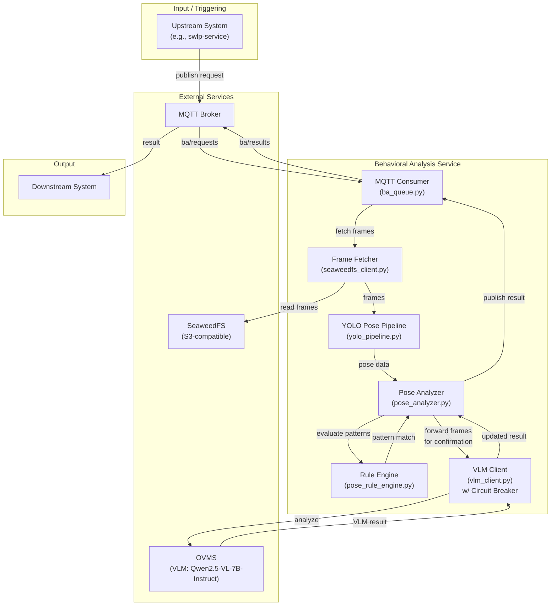
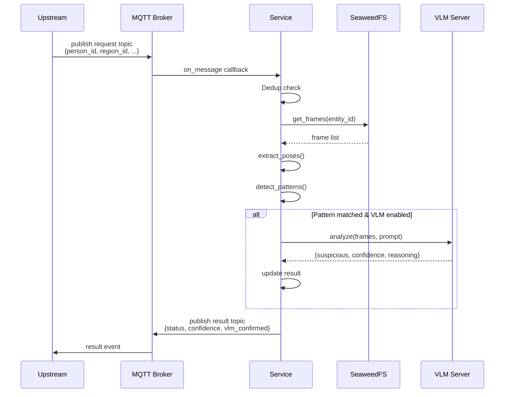

# Behavioral Analysis Service

## 1. Overview

The Behavioral Analysis Service is a reusable Intel-developed microservice that detects pose-based behavioral patterns through a declarative YAML-driven rule engine. New behaviors can be defined without code modification by adding or updating patterns in `config/patterns.yaml`, making the service architecturally extensible to arbitrary domains.

**Current implementation:**
- One reference pattern included: `shelf_to_waist` (retail loss-prevention example)
- Architecture supports arbitrary pose-based patterns; new patterns can be added via configuration

**Core capabilities:**
- Pose keypoint extraction via YOLO26n-pose (OpenVINO Runtime)
- Declarative YAML-driven pattern engine (supports positional, angular, distance, velocity conditions)
- Optional VLM-based frame-level visual confirmation
- Event-driven processing via MQTT
- Stateless design with external frame storage

---

## 2. Runtime Architecture

### Architecture Diagram



### Request/Response Flow (MQTT Path)



---

## 3. Service Components

| Component | Responsibility |
|---|---|
| **MQTT Consumer** | Subscribe to requests, dispatch analysis, publish results |
| **Frame Storage Client** | Async S3-compatible frame retrieval (aioboto3) |
| **Pose Extraction** | YOLO-Pose inference orchestration per frame |
| **OpenVINO Wrapper** | OpenVINO IR model loading, letterboxing, NMS |
| **Pattern Detection** |  Orchestrates pose + VLM confirmation |
| **Rule Engine** | Evaluates YAML-defined pose conditions and phases |
| **VLM Client** | OpenAI-compatible HTTP client with circuit breaker |

---

## 4. Key Features

### 4.1 Pose Extraction

- **Model:** YOLO26n-pose (OpenVINO IR format); runs without PyTorch dependencies
- **Keypoints:** COCO 17-point skeletal format (pose coordinates + per-keypoint confidence)
- **Device support:** CPU, GPU, NPU (configurable via `GST_INFERENCE_DEVICE`)
- **Configuration:** `POSE_CONFIDENCE_THRESHOLD` (default 0.5) controls detection quality filtering

See [How It Works](./how-it-works.md#pose-extraction) for implementation details (preprocessing, model output format, NMS).

### 4.2 Declarative Pattern Engine

**Pattern file:** `config/patterns.yaml`

**Supported relations:** Positional (`above`, `below`, `left_of`, `right_of`), distance (`near`, `far`), velocity (`moving_fast`, `stationary`), angular (`bent`, `straight`), and negation (`not_<relation>`)

**Key capabilities:**
- Temporal phasing: Define multi-step behaviors with ordered phases and per-phase frame count requirements
- Bilateral expansion: Use `per_side: true` to auto-expand conditions for left/right body sides
- No code changes required: Add or modify patterns in `config/patterns.yaml` and restart the service

**Example pattern:** `shelf_to_waist` (built-in retail concealment detection)
```yaml
patterns:
  shelf_to_waist:
    enabled: true
    alert_type: CONCEALMENT
    pose:
      phases:
        - name: arm_handling_near_body
          min_frames: 20
          conditions:
            - subject: elbow
              relation: bent
              reference: [shoulder, wrist]
              min_angle: 20
              max_angle: 165
            - subject: wrist
              relation: near
              reference: waist_midpoint
              threshold: 0.40
```

### 4.3 VLM Confirmation

- **Capability:** Optional frame-level visual confirmation when pose patterns match
- **Endpoint:** OpenAI-compatible API (default: OVMS Qwen2.5-VL-7B-Instruct)
- **Per-pattern control:** Enable/disable VLM confirmation at the pattern level in `config/patterns.yaml`
- **Configuration:** `VLM_ENABLED`, `VLM_ENDPOINT`, `VLM_MAX_CONCURRENCY`, `VLM_MAX_IMAGE_SIZE`
- **Response:** Parses model output for `{suspicious: bool, confidence: float, reasoning: str}` fields

See [How It Works](./how-it-works.md#vlm-confirmation) for implementation details (circuit breaker, image encoding, scoring logic).

### 4.4 Entity Deduplication & Backpressure

- **Dedup:** Skips analysis if the same entity is already in-flight
- **Max concurrency:** `max_inflight_analyses` (default 3) caps concurrent analysis tasks
- **Behavior:** Requests exceeding capacity are dropped (logged but not queued)

---

## 5. Integration

### 5.1 MQTT Interface

**Request Topic:** Configurable (default `ba/requests`)
- **Direction:** Subscribe
- **Payload schema:**
  ```json
  {
    "person_id": "string (required)",
    "region_id": "string (optional)",
    "entry_timestamp": "string (optional)",
    "scene_id": "string (optional)",
    "last_frame_ts": "string (optional)"
  }
  ```

**Result Topic:** Configurable (default `ba/results`)
- **Direction:** Publish
- **Payload schema:**
  ```json
  {
    "person_id": "string",
    "region_id": "string",
    "entry_timestamp": "string",
    "scene_id": "string",
    "last_frame_ts": "string",
    "status": "string (no_enough_data | no_match | suspicious)",
    "confidence": "float (0.0–1.0)",
    "frames_analyzed": "integer",
    "vlm_response": "object or null (present only if VLM was invoked)",
    "pattern_id": "string (optional; present if pattern matched)",
    "description": "string (optional; present if pattern matched)",
    "vlm_confirmed": "boolean or null (optional; present if pattern matched and VLM enabled)"
  }
  ```

**Status values:**
- `"no_enough_data"` — Frame fetch failed or insufficient frames available
- `"no_match"` — Sufficient frames analyzed; no pattern matched
- `"suspicious"` — Pattern matched; entity flagged as suspicious

### 5.2 SeaweedFS Frame Storage

**Expected structure in S3-compatible storage:**

Bucket name is configurable via `SEAWEEDFS_BUCKET` environment variable (default: `behavioral-frames`)

```
{SEAWEEDFS_BUCKET}/
├── {entity_id}/
│   └── {region_id}/
│       └── {entry_timestamp}/
│           └── frames/
│               ├── {timestamp_1}.jpg
│               ├── {timestamp_2}.jpg
│               └── ...
```

**Service behavior:**
- Reads frames on demand (no uploads)
- Sorts by timestamp filename (chronological order)
- Fetches up to `MAX_FRAMES_TO_FETCH` (default 30) most recent frames
- Does not create, modify, or delete stored frames

### 5.3 Configuration

**Environment variables:** All settings loaded via Pydantic `BaseSettings` from `config.py`

| Category | Variables |
|---|---|
| **Service** | `DEBUG`, `LOG_LEVEL` |
| **Pose model** | `YOLO_POSE_MODEL`, `GST_INFERENCE_DEVICE`, `POSE_CONFIDENCE_THRESHOLD` |
| **Frame analysis** | `MIN_FRAMES_FOR_DETECTION`, `MAX_FRAMES_TO_FETCH`, `POSE_FRAMES_COUNT` |
| **SeaweedFS** | `SEAWEEDFS_ENDPOINT`, `SEAWEEDFS_BUCKET`, `SEAWEEDFS_ACCESS_KEY`, `SEAWEEDFS_SECRET_KEY` |
| **VLM** | `VLM_ENABLED`, `VLM_ENDPOINT`, `VLM_MODEL_NAME`, `VLM_TIMEOUT`, `VLM_MAX_TOKENS`, `VLM_TEMPERATURE`, `VLM_MAX_IMAGE_SIZE`, `VLM_MAX_CONCURRENCY` |
| **MQTT** | `MQTT_HOST`, `MQTT_PORT`, `BA_REQUEST_TOPIC`, `BA_RESULT_TOPIC` |
| **Patterns** | `PATTERN_CONFIG_PATH` |

---

## 6. Use Cases

### 6.1 Extensible Pattern Framework

The Behavioral Analysis Service is designed for extensibility through its declarative pattern engine. New behaviors are defined by adding or modifying YAML patterns in `config/patterns.yaml` — no code changes or redeployment required.

**Implemented pattern:**
- `shelf_to_waist` — retail loss-prevention example (hand moving from shoulder-height to waist with bent elbow)

**Pattern definition capabilities:**
- Positional checks (e.g., "wrist above head", "hand left of torso")
- Temporal ordering (e.g., "phase 1: arm bent, then phase 2: arm extended")
- Angular constraints (e.g., "elbow bent between 20–165 degrees")
- Distance thresholds (e.g., "wrist within 0.4× torso-length of waist")
- Optional VLM visual confirmation with domain-specific prompts

**Deployment:** SeaweedFS + MQTT broker + upstream frame-capture system. VLM/OVMS optional for pose-only analysis.

### 6.2 Example Patterns (Illustrative)

These examples demonstrate how new patterns can be added; they are NOT included in this release:

**Implemented example:**
```yaml
patterns:
  shelf_to_waist:
    # Hand moving from shoulder-height to waist with bent elbow
    enabled: true
    alert_type: CONCEALMENT
    pose:
      phases:
        - name: arm_handling_near_body
          min_frames: 20
          conditions:
            - subject: elbow
              relation: bent
              reference: [shoulder, wrist]
              min_angle: 20
              max_angle: 165
            - subject: wrist
              relation: near
              reference: waist_midpoint
              threshold: 0.40
```

**How to add custom patterns:** Modify `config/patterns.yaml` and restart the service:
```yaml
patterns:
  # ... existing patterns ...
  
  falling_hazard:
    # Example: detect person falling backward (workplace safety)
    enabled: true
    pose:
      phases:
        - conditions:
            - subject: head_center
              relation: below
              reference: torso_center
              
  reaching_high:
    # Example: detect reaching high overhead (healthcare monitoring)
    enabled: true
    pose:
      phases:
        - conditions:
            - subject: wrist
              relation: above
              reference: head_center
```

Restart the service; new patterns activate immediately.

---

## 7. Dependency on External Services

| Service | Purpose | Criticality | Availability Required |
|---|---|---|---|
| **SeaweedFS (S3-compatible)** | Frame storage; reads only | Required | At startup and per request |
| **MQTT Broker** | Request/result messaging | Required for event mode | At startup and throughout operation |
| **OVMS (VLM server)** | Visual confirmation | Optional (pose-only if disabled) | Only when `VLM_ENABLED=true` |

---

## References

- [Get Started](./get-started.md) — Step-by-step run instructions
- [How It Works](./how-it-works.md) — Detailed architecture and request flows
- [API Reference](./api-reference.md) — HTTP and MQTT endpoint schemas
- [Configuration](./get-started/configuration.md) — Full environment variable reference
- [Troubleshooting](./troubleshooting.md) — Common issues and resolution
