# How It Works

This page describes the architecture and the internal flow of a SceneScape
event through the microservice.

## Architecture

At a high level, the Scene Understanding Service is a FastAPI service that
subscribes to SceneScape MQTT topics, maintains a per-person session state
machine, evaluates a declarative rule engine against each event, and acts on
the rule output by firing alerts and/or escalating to behavioral analysis.

```mermaid
%%{init: {
  'theme': 'base',
  'themeVariables': {
    'fontFamily': '"IntelOne Display", "Intel Clear", "Inter", "Segoe UI", Arial, sans-serif',
    'fontSize': '14px',
    'primaryColor': '#0068B5',
    'primaryTextColor': '#FFFFFF',
    'primaryBorderColor': '#00377C',
    'lineColor': '#00377C',
    'secondaryColor': '#EEF3F8',
    'tertiaryColor': '#F7F8FA',
    'background': '#FFFFFF',
    'mainBkg': '#FFFFFF',
    'clusterBkg': '#F7F8FA',
    'clusterBorder': '#0068B5',
    'edgeLabelBackground': '#FFFFFF',
    'noteBkgColor': '#F7F8FA',
    'noteTextColor': '#3A3A3A'
  }
}}%%
flowchart LR
    Scene([SceneScape<br/>MQTT Broker])
    SceneAPI([SceneScape<br/>REST API])

    subgraph Service["Scene Understanding Service (FastAPI, :8082)"]
        MQTT["MQTT Subscriber<br/>(scene/region/image topics)"]
        SM["Session Manager<br/>(per-person state machine)"]
        RA["Rule Adapter<br/>(sessions → rule engine)"]
        RE["Rule Engine<br/>(rules.yaml)"]
        BA["BA Orchestrator<br/>(escalate action)"]
        API["REST API<br/>(/api/v1/lp/*)"]
    end

    SeaweedFS[("SeaweedFS<br/>frame storage")]
    BAWorker{{"behavioral-analysis<br/>(pose + VLM)"}}
    AlertSvc{{"alert-service"}}

    Scene -- "person + zone events" --> MQTT
    MQTT --> SM
    SM -- "events" --> RA
    RA --> RE
    RE -- "alert action" --> AlertSvc
    RE -- "escalate action" --> BA
    BA -- "ba/requests" --> BAWorker
    BAWorker -- "ba/results" --> BA
    BA -. "capture frames" .-> SeaweedFS
    SceneAPI -. "zone discovery (startup)" .-> Service
    API -- "sessions / zones / alerts" --> Client([Client])

    classDef client fill:#FFFFFF,stroke:#0068B5,stroke-width:2px,color:#3A3A3A;
    classDef core fill:#0068B5,stroke:#00377C,stroke-width:1.5px,color:#FFFFFF;
    classDef backend fill:#00A3F4,stroke:#00377C,stroke-width:1.5px,color:#FFFFFF;
    classDef store fill:#6C6C6C,stroke:#0068B5,stroke-width:1.5px,color:#FFFFFF;
    classDef ext fill:#00C7FD,stroke:#00377C,stroke-width:1.5px,color:#3A3A3A;

    class Client,Scene,SceneAPI client;
    class MQTT,SM,RA,RE,API core;
    class BA backend;
    class SeaweedFS store;
    class BAWorker,AlertSvc ext;

    style Service fill:#F7F8FA,stroke:#0068B5,stroke-width:1.5px,color:#3A3A3A;
```

**Key planes:**

- **MQTT subscriber** — consumes SceneScape scene-data, region-event,
  region-data, and camera-image topics; the connection details and topic
  patterns come from `scene-config.yaml`.
- **Session manager** — keeps a per-person session (zone visits, dwell time,
  liveness, flags) and emits domain events (zone entry/exit, loiter).
- **Rule engine** — evaluates `rules.yaml` against each event and produces two
  action types: `alert` and `escalate`.
- **BA orchestrator** — handles `escalate` actions: captures frames to
  SeaweedFS and drives behavioral analysis over the `ba/requests` /
  `ba/results` MQTT topics.
- **REST API** — exposes session, zone, and alert state under `/api/v1/lp`.

## Event Flow

1. **Startup zone discovery** — The service authenticates to the SceneScape
   REST API (`scenescape_api`) and resolves each configured zone name to its
   region UUID. Scene names are likewise resolved to scene UUIDs.
2. **MQTT subscribe** — The service subscribes to the SceneScape topics
   defined in `scene-config.yaml` (`scene_data_topic_pattern`,
   `region_event_topic_pattern`, etc.) and retries in the background until the
   broker is reachable.
3. **Session update** — Incoming scene-data and region events update the
   per-person `PersonSession` (last-seen, current cameras, current zones,
   dwell time). Only persons seen on configured cameras are tracked.
4. **Rule evaluation** — Each domain event (zone entry, zone loiter,
   ba_result) is passed to the rule engine, which evaluates triggers and
   conditions defined in `rules.yaml`.
5. **Actions** — For each matched rule:
   - `alert` — builds an alert (deduplicated per session/zone as configured)
     and POSTs it to the alert-service.
   - `escalate` — invokes the named service (e.g. `behavioral_analysis`),
     which captures frames and publishes a `ba/requests` message.
6. **Behavioral analysis (optional)** — The behavioral-analysis worker returns
   a verdict on `ba/results`; the service folds it back into the session
   (setting flags later `alert` rules can escalate severity on).
7. **API access** — Clients read live session, zone, and alert state through
   the REST API; zone re-discovery can be triggered on demand.

## Components

- `main.py` — FastAPI app entry point and startup wiring.
- `api/routes.py` — REST routes under `/api/v1/lp`.
- `services/config.py` — loads `scene-config.yaml` + `rules.yaml`.
- `services/mqtt_service.py` — SceneScape MQTT subscriber.
- `services/session_manager.py` — per-person session state machine.
- `services/rule_adapter.py` — bridges sessions to the rule engine and acts on
  rule output.
- `services/ba_orchestrator.py`, `services/ba_queue.py` — behavioral-analysis
  escalation over MQTT.
- `services/frame_capture.py`, `services/frame_manager.py` — SeaweedFS evidence
  frames.
- `services/alert_service_client.py` — HTTP client for the alert-service.
- `services/scenescape_client.py` — SceneScape REST client (zone discovery).
- `rule_engine/` — bundled, generic YAML rule evaluator.

## Configuration Surface

All runtime behavior is driven by `scene-config.yaml` and `rules.yaml`, with a
small set of environment variables for identity and credentials. See the
[Configuration Guide](./get-started/configuration.md) for the full field list.
