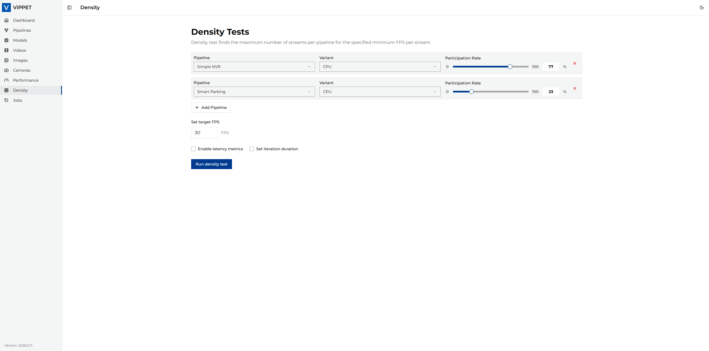

# Stream Density Testing

This article explains how to run density tests in ViPPET and interpret the results.
A density test finds the maximum number of streams that can run while keeping the target
minimum FPS per stream. Compared to a standard performance test (fixed stream count),
density testing increases the load and searches for the highest stable stream count that
still meets your FPS requirement.
Therefore, it answers the question: `How many concurrent streams can this platform sustain
at my required FPS floor?`

## Density Testing Algorithm

The density testing algorithm is designed to find the maximum number of concurrent video
streams that can be processed while maintaining a minimum performance threshold (FPS floor).
The algorithm uses a two-phase approach:

### Phase 1: Exponential Growth

- Start with 1 stream and run the pipeline.
- Double the stream count after each successful run that meets the FPS threshold.
- Continue exponentially (`1 -> 2 -> 4 -> 8 -> 16...`) until the per-stream FPS drops below the specified `fps_floor`.
- Track the best configuration that still meets the performance requirements.

### Phase 2: Binary Search Refinement

- Switch to binary search once performance drops below the threshold.
- Set bounds:
  - Lower bound = last successful stream count (`N/2`).
  - Upper bound = current failing stream count (`N`).
- Bisect the range and test the midpoint.
- Adjust bounds based on results:
  - If `FPS >= threshold`: update best config, move lower bound up.
  - If `FPS < threshold`: move upper bound down.
- Continue until bounds converge.

### Stream Distribution

- Multiple pipelines can be tested simultaneously.
- Stream allocation is proportional based on `stream_rate` ratios (must sum to `100%`).
- Rounding handling: the last pipeline gets remaining streams to account for rounding errors.

### Algorithm result

The algorithm returns the optimal configuration with:

- Maximum number of streams that meet the FPS requirement.
- Distribution of streams across pipelines.
- Achieved per-stream FPS.
- Output file paths for video results (from the best-passing iteration).
- Latency statistics (avg/min/max) when latency metrics are enabled.

## Running Density Testing

Density testing helps you find the maximum number of concurrent streams that still
meet a required FPS floor.

### Step 1: Test Configuration

Before running the test, configure the workload in the **Density** tab:

1. Open the **Density** tab.
2. Set **FPS Floor** — minimum acceptable per-stream FPS (for example, `30`).
3. Add one or more pipelines.
4. For each pipeline, set **Stream Rate** so all pipelines sum to `100%`.
5. Set **Max runtime** — duration of each iteration in seconds (for example, `10`).

| Parameter                  | Description                                                                                                      | Example                              |
|----------------------------|------------------------------------------------------------------------------------------------------------------|--------------------------------------|
| **FPS Floor**              | Minimum acceptable per-stream FPS. The algorithm stops when it cannot maintain this threshold.                   | `30`                                 |
| **Stream Rate**            | Percentage of total streams allocated to this pipeline. All rates must sum to 100%.                              | Pipeline A: `60%`, Pipeline B: `40%` |
| **Max runtime**            | How long each iteration runs before measuring FPS (seconds). Longer iterations provide more stable measurements. | `10`                                 |
| **Output mode**            | `disabled` or `file`. Live streaming is not supported for density tests.                                         | `disabled`                           |
| **Enable latency metrics** | When enabled, measures end-to-end pipeline latency (avg/min/max) per reporting interval.                         | `disabled`                           |

> **Note:** USB cameras are not supported in density testing because the algorithm needs to spawn
> multiple copies of the same pipeline, which is not possible with a single physical camera device.

### Step 2: Running the Test

After configuration, click **Run density test**.

What happens during execution:

- ViPPET starts with 1 stream and runs the pipeline for `max_runtime` seconds.
- If per-stream FPS ≥ `fps_floor`, the stream count doubles (exponential growth phase).
- When FPS drops below `fps_floor`, ViPPET switches to binary search to refine the exact maximum.
- The process ends when the algorithm converges on the best stable configuration.
- Progress is reported in real time via the job status details.

> **Important:** If you cancel a density test while it is running, the job is marked as **FAILED**.
> Partial density results are not reported because the algorithm has not yet converged on a reliable answer.

### Step 3: Interpreting Test Results

When the job completes, ViPPET reports the best configuration that met the FPS floor:

| Result                        | Description                                                                            |
|-------------------------------|----------------------------------------------------------------------------------------|
| **Per Stream FPS**            | Achieved FPS per stream in the best configuration (≥ fps_floor)                        |
| **Total Streams**             | Maximum number of concurrent streams that sustained the required FPS                   |
| **Streams per Pipeline**      | Distribution of streams across pipelines according to stream_rate ratios               |
| **Output videos**             | Paths to output files from the best iteration (if output mode was `file`)              |
| **Latency (avg / min / max)** | End-to-end pipeline latency in milliseconds, reported when latency metrics are enabled |

### Comparing results across platforms

Use density results to compare hardware capabilities:

- Higher **total streams** at the same FPS floor indicates better density — the platform can handle more workloads.
- **Per-stream FPS** should stay at or above the configured floor.
- For stable comparison between platforms, keep the same FPS floor, input video, and pipeline configuration.
- Compare results across devices (CPU vs GPU vs NPU) using the same test profile.

### Example: reading density results

If you set `fps_floor = 30` and the test reports `total_streams = 12` with `per_stream_fps = 31.5`:

- The platform can run **12 concurrent streams** of this pipeline while maintaining at least 30 FPS per stream.
- At 13 streams, per-stream FPS dropped below 30, so the algorithm reported 12 as the maximum.
- The actual measured FPS (31.5) slightly exceeds the floor — this is the result from the best-passing iteration.
